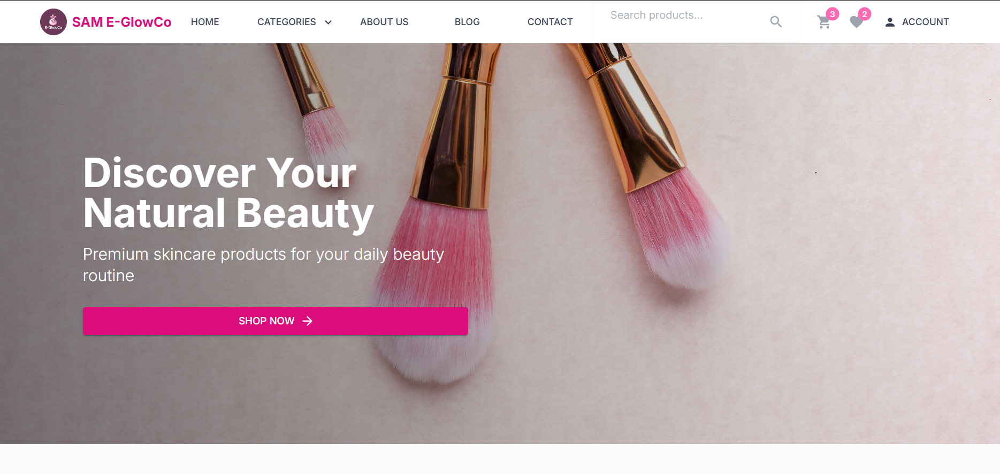
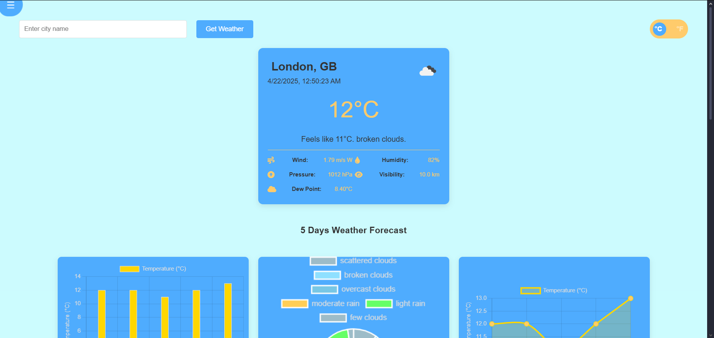

  <!-- Animated Profile Image -->
  
  
  <!-- Animated Header Banner with Dynamic Wave Effect -->
  
  
  

  <!-- Live Status Indicators -->
  

    
    
    
  

  <!-- GitHub Activity Animation -->
  

 

<h2 align="center">
   
  About Me
</h2>

  <!-- Improved Right-Side Animation -->
  

  > *`Passionate developer focused on creating elegant and efficient web solutions`*

   &nbsp; I'm currently working on expanding my full-stack development skills
  
   &nbsp; I'm currently learning advanced React patterns and Node.js architecture
  
   &nbsp; I'm looking to collaborate on innovative web applications
  
   &nbsp; Always excited to work on projects that make a difference
  
   &nbsp; Fun fact: When I'm not coding, I enjoy exploring new technologies

 

<!-- Animated Divider -->

<h2 align="center">
   
  Technical Skills
</h2>

<table align="center">
  <tr>
    <td align="center" width="96">
      
       JavaScript
    </td>
    <td align="center" width="96">
      
       React
    </td>
    <td align="center" width="96">
      
       Node.js
    </td>
    <td align="center" width="96">
      
       REST API
    </td>
    <td align="center" width="96">
      
       GitHub
    </td>
    <td align="center" width="96">
      
       MySQL
    </td>
  </tr>
</table>

<!-- Frontend Development Animated Icons -->
<h3 align="center">Frontend Development</h3>

  

<!-- Backend Development Animated Icons -->
<h3 align="center">Backend Development</h3>

  

<!-- Tools Animated Icons -->
<h3 align="center">Tools & Technologies</h3>

  

<!-- Animated Skill Progress Bars -->

  

<!-- Animated Divider -->

<h2 align="center">
   
  Featured Projects
</h2>

<!-- Project Showcase Intro -->

  <i>Here are some of my notable projects that showcase my skills and passion for development</i>

  <!-- Project Filter Tags -->
  

    
    
    
    
  

 

<table>
  <tr>
    <td width="50%">
      <h3 align="center">
         
        💼 E-Commerce Platform
      </h3>
      

        
        

          <strong>Full-Stack E-Commerce Application</strong>
           
          A comprehensive shopping platform with product catalog, 
          shopping cart, secure payment integration, and user authentication.
            
          <code>📌 React • Node.js • Express • MongoDB • Stripe</code>
        

        

          
          
          
        

      

    </td>
    <td width="50%">
      <h3 align="center">
         
        ☁️ Forecast Forge
      </h3>
      

        
        

          <strong>Weather Website</strong>
           
          ForecastForge is a weather forecasting web application that provides users with current weather data and a 5-day forecast for any city they enter. 
            
          <code>📌 HTML • CSS • Javascript • Chart.js • Material UI</code>
        

        

          
          
          
        

      

    </td>
  </tr>
  <tr>
    <!-- <td width="50%">
      <h3 align="center">
         
        🎮 Gaming Community Platform
      </h3>
      

        
        

          <strong>Interactive Gaming Community</strong>
           
          A platform for gamers to connect, share experiences, organize 
          events, and form teams with real-time chat functionality.
            
          <code>📌 Next.js • Socket.io • MongoDB • Tailwind CSS</code>
        

        

          
          
        

      

    </td>
    <td width="50%">
      <h3 align="center">
         
        📱 Fitness Tracker App
      </h3>
      

        
        

          <strong>Health & Fitness Management App</strong>
           
          A comprehensive fitness tracking application with workout plans, 
          nutrition tracking, and progress visualization.
            
          <code>📌 React Native • Redux • Node.js • Express</code>
        

        

          
          
          
        

      

    </td>
  </tr> -->
</table>

<!-- More Projects Button -->

  

<!-- Project Stats -->

  
  
  

<!-- Animated Divider -->

<h2 align="center">
   
  GitHub Stats
</h2>

  <!-- 3D Contribution Calendar -->
  
  
   
   
  
  <!-- Stats Cards in Same Row -->
  

    
    
  

 

<!-- Trophies with Animation Effect -->

  

<!-- Animated Divider -->

<h2 align="center">
   
  Connect with Me
</h2>

  
  
  
  <!--  -->

<!-- Quotes Generator -->

  

<!-- Live Coding Status -->

  
  

<!-- Fancy Animated Footer -->

  

<!---
Amnahsan/Amnahsan is a ✨ special ✨ repository because its `README.md` (this file) appears on your GitHub profile.
You can click the Preview link to take a look at your changes.
--->
